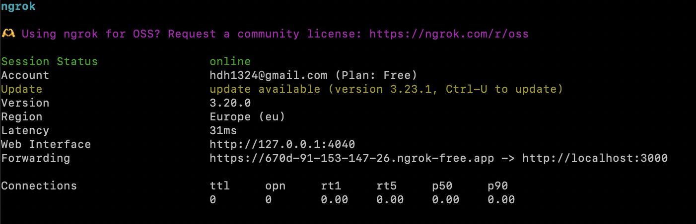

# 🐍 Speedy Serpent

Speedy Serpent in an online muliplayer game with a singleplayer mode against AI opponents. Game server is designed to host one game at a time for 2-4 players.


## Features

- Online multiplayer mode for 2-4 players
- Singleplayer mode against 1-3 AI opponents
- Sound effects
- Custmoizable AI oppoents
- Keyboard controls
- Adjustable game duration
- Power-ups:speedup, slowdown and teleport
- Game can be paused and restarted

## Tech Stack

- Node.Js, express.Js, Socket.IO, React, TypeScript

## My Contribution

- Architected the core game system, defining resource flow, game state transitions, and feature modules.
- Built a real-time multiplayer backend with Express & Socket.IO, including room and player state logic.
- Created a consistent game loop with support for pause/resume and randomly spawning items.
- Implemented precise collision detection and dynamic mode switching between multiplayer and AI-based singleplayer.
- Created AI opponents using A\* pathfinding, each with unique behavior patterns and difficulty levels.

## What I Learned

- Real-time multiplayer networking fundamentals.
- Frame-rate–based game-loop design and speed control.
- Resource & state management patterns in online games.
- Performance optimization techniques
- Decision-making and pathfinding logic for AI opponents.

## What I Would Improve

- Support multiple simultaneous game sessions.
- Introduce a global leaderboard for top scores.
- Make keyboard input feel even more responsive.

## Set up the game

Clone this repository

```sh

git clone https://github.com/hyun-1324/Speedy_Serpent.git

```

Make sure you have `node` and `npm` installed.

```sh

npm -v
node -v

```

If these commands print version numbers to the console, you are good to go. Otherwise install them.

To set up the game, run the following command **in the root directory** of the project:

```sh

node setup.mjs

```

Once the project is set up, start the server with the command:

```sh

npm run start

```

Note that if any changes are made to the project during review, you should run the setup again.
Server runs on port 3000 and it can be shut down with `Ctrl` + `C`.

### Expose the server with ngrok

You can use ngrok to allow friends to join the game session from different networks.

Install ngrok on your device if you have not done that already. Instruction can be found here:

https://download.ngrok.com/linux?tab=install

Use the following command on a separate terminal to start ngrok:

```sh

ngrok http 3000

```

Now your terminal should show something like this:



Copy the URL that can be found in the `forwarding` field and open it in the browser.

By sharing that URL with friends, they can join your game.

## How to use the game UI

Game can be joined only when the other players are in the lobby. The first player to join an empty lobby will be assigned as the game host.
If the host leaves, a new host will be assigned.

The host can:

<table>
  <tr>
    <td></td>
    <td>Start the game from the lobby</td>
  </tr>
  <tr>
    <td></td>
    <td>Restart the game if it has already started (from the pause menu)</td>
  </tr>
  <tr>
    <td></td>
    <td>Guide everyone back to the lobby (from the pause menu)</td>
  </tr>
  <tr>
    <td> </td>
    <td>Decide what to do when the game is over (play again or go back to the lobby)</td>
  </tr>
</table>

Every player can:

<table>
  <tr>
    <td> </td>
    <td>Pause/resume the game</td>
  </tr>
  <tr>
    <td></td>
    <td>Leave the game (others will continue playing if there are enough players to continue)</td>
  </tr>
  <tr>
    <td> </td>
    <td>Mute/unmute the sound</td>
  </tr>
  <tr>
    <td></td>
    <td>See the instructions</td>
  </tr>
</table>

Instructions how to play the game can be found in the game itself behind the i-button.

## Singleplayer mode

Host may choose to play a singleplayer game against 1-3 AI opponents. A switch to toggle between singleplayer and multiplayer modes is available in the game lobby.

The game provides three strategy profiles for selecting opponents:

1. **Normal Snake**: Has no resource preference and gathers all types of nearby resources equally.
2. **Bold Snake**: Prioritizes teleport and speedup resources over others.
3. **Aggressive Snake**: Attempts to attack players who enter a certain range.
4. **Safe Snake**: Prioritizes safety by first gathering plain and slowdown resources, then speedup resources. Avoids teleport resources to maintain safe positioning.

Each profile comes with three difficulty levels: Easy, Medium, and Hard. In easier modes, opponents don’t adjust direction as much, which increases their risk of colliding with walls, other snakes, or themselves.

<span style="font-size: 24px;">🐍 Happy gaming! 🐍</span>

## License

This project is licensed under the MIT License.
See the [LICENSE](./LICENSE) file for details.
